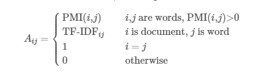

# feedback_prize2022

__[Competition Information](https://www.kaggle.com/competitions/feedback-prize-effectiveness)__

| model         | dropout | lr   | optimizer | scheduler         | loss  |
| ------------- | ------- | ---- | --------- | ----------------- | ----- |
| debertav3base | 0.2     | 2e-5 | AdamW     | warm-up           | 0.788 |
| debertav3base | 0.3     | 1e-5 | AdamW     | cosineAnnealingLR | 0.67  |
| robertabase   | 0       | 2e-5 | AdamW     | warm-up           | 0.649 |

__Graph__

